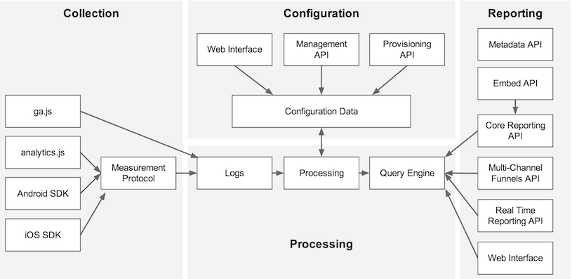

## 概述

[Google Analytics](https://developers.google.com/analytics/devguides/collection/analyticsjs/how-analyticsjs-works) 是一个前端监控分析库，整体架构如下图所示：



`analytics.js`会通过`google-analytics.com/collect`接口发送监控数据给 Google Analytics 平台，数据需要遵循[Measurement Protocol 支持的参数](https://developers.google.cn/analytics/devguides/collection/protocol/v1/parameters)。

搭配 [autotrack.js](https://github.com/googleanalytics/autotrack)即可一键部署监控流程，如下配置即可：

```html
<script>
  window.ga =
    window.ga ||
    function() {
      (ga.q = ga.q || []).push(arguments);
    };
  ga.l = +new Date();
  ga('create', 'UA-XXXXX-Y', 'auto');

  // Replace the following lines with the plugins you want to use.
  ga('require', 'eventTracker');
  ga('require', 'outboundLinkTracker');
  ga('require', 'urlChangeTracker');
  // ...

  ga('send', 'pageview');
</script>
<script async src="https://www.google-analytics.com/analytics.js"></script>
<script async src="path/to/autotrack.js"></script>
```

## 工作原理

我们通过在 window.ga.q 中加入指令，当 analytics.js 加载完毕后会立即查看 ga.q 数组的内容并依次执行每条命令，然后 ga() 函数将被重新定义以立即执行后续调用。

autotrack 库做的就是在错误收集、页面性能、用户行为等场景收集数据并替我们编写指令。我们可以通过更简单的[代码演示](https://github.com/philipwalton/analyticsjs-boilerplate)了解如何在不同场景中收集数据并编写指令。

## 指令

> 详细参考[官方文档](https://developers.google.cn/analytics/devguides/collection/analyticsjs/command-queue-reference)。

### create

> 创建一个新的跟踪器实例。

- 用法：ga('create', [trackingId], [cookieDomain], [name], [fieldsObject])

### send

> 向 Google Analytics（分析）发送数据。

- 用法：ga('[trackerName.]send', [hitType], [...fields], [fieldsObject])

最终所发送的字段值是通过将 `...fields` 参数和 `fieldsObject` 指定的值与 tracker 中当前存储的值合并到一起得到的。`...fields` 参数和 `fieldsObject` 指定的值是一次性的，不会合并到跟踪器实例中。

send 指令支持如下的 hitType 及字段：

- pageview: page
- event: eventCategory、eventAction、eventLabel、eventValue
- social: socialNetwork、socialAction、socialTarget
- timing: timingCategory、timingVar、timingValue、timingLabel

### set

> 在跟踪器对象上设置一个或一组字段/值对，这些值不会在 send 指令后清空，算是一个跟踪器实例的全局对象了。

- 用法一：ga('[trackerName.]set', fieldName, fieldValue)
- 用法二：ga('[trackerName.]set', fieldsObject)

`analytics.js` 的所有可配置字段名称见[字段参考](https://developers.google.cn/analytics/devguides/collection/analyticsjs/field-reference)。

我不是很清楚这个字段和 Measurement Protocol 支持的参数有什么区别？

答：貌似可配置字段是面向开发人员的命名格式，而 Measurement Protocol 的参数则是缩写，比如 javaEnabled 变成了 je。

### require

注册一个 analytics.js 外部插件。

- 用法：ga('[trackerName.]require', pluginName, [pluginOptions])

### provide

提供一个 analytics.js 自定义插件，以便在 ga() 命令队列中使用。

- 用法：ga('provide', pluginName, pluginConstuctor)

### remove

移除跟踪器实例。

- 用法：ga('[trackerName.]remove')

## 额外扩展

如果我们想要搭建自己的数据收集平台，初略总结有 3 种方法：

1. 可以修改源码中的上报 api，并将数据平台的数据结构按照 ga 传输的来设计。
2. 通过 tracker.get 获取 tracker 内部数据再组装后上报到自己的接口中
3. 模仿 `analytics.js` 实现前端数据监控 sdk
4. 总感觉 `analytics.js` 是支持自定义上报 api 的，得再研究下

个人则希望能模拟 `analytics.js` 实现一版简化版的前端数据监控 sdk，使自己对前端数据监控的原理更加了解。

## 参考链接

https://developers.google.cn/analytics/devguides/platform
https://support.google.com/analytics/answer/2731565
https://developers.google.cn/analytics/devguides/collection/analyticsjs/
https://philipwalton.com/articles/the-google-analytics-setup-i-use-on-every-site-i-build/
https://ga-dev-tools.appspot.com/dimensions-metrics-explorer/
