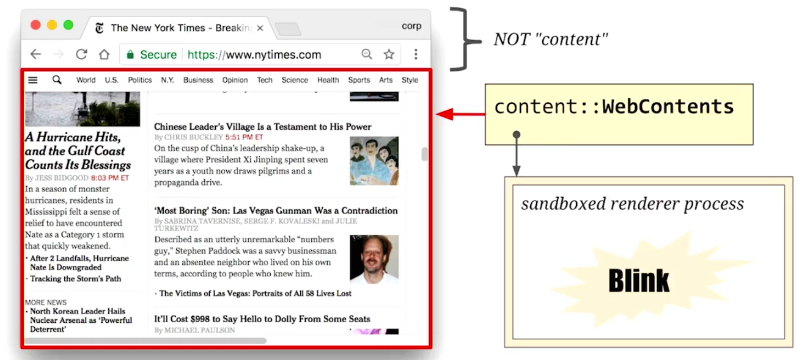
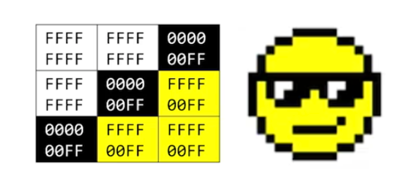
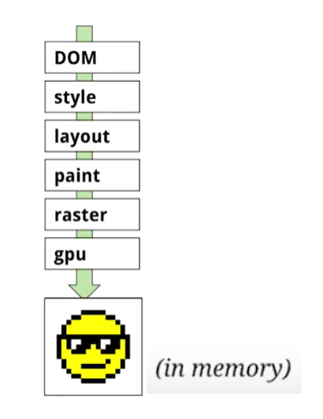
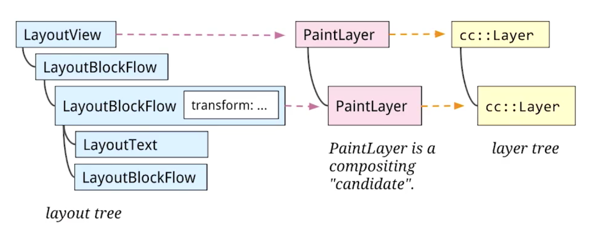
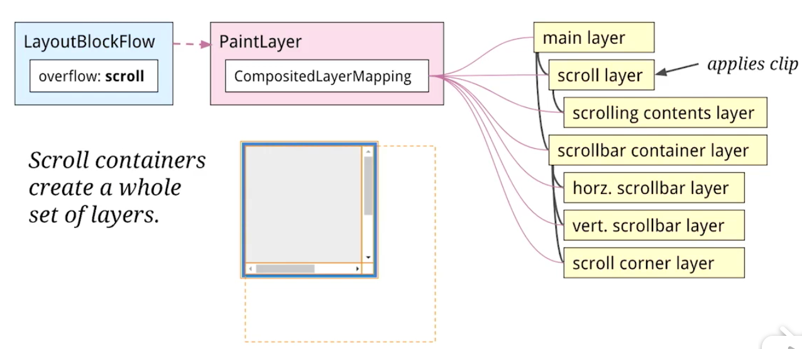
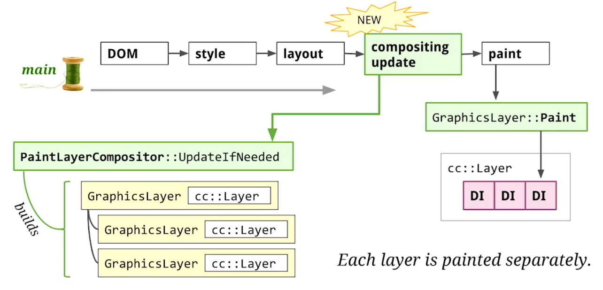
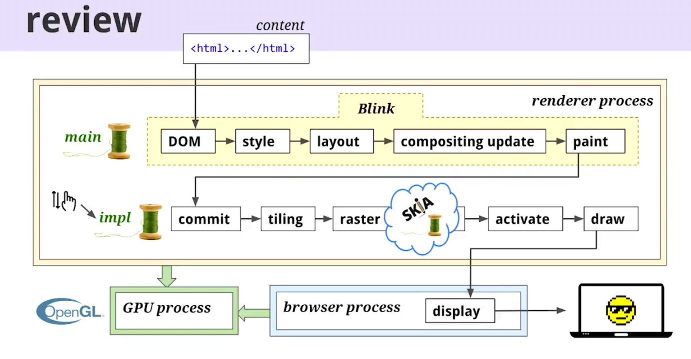

:::tip
[参考](https://www.bilibili.com/video/av35265997/)

[之前的文章](./rendering-principle.md)
:::

## 引言

这里讲的浏览器主要指 Chrome，其他的浏览器渲染机制应该也不会差很多吧。Chrome 使用的 Blink 渲染引擎是 Chrome 团队对开源渲染引擎 Webkit 的后续迭代版，浏览器内核=渲染引擎+JS 引擎。

在文章开头，需要先提及一些词汇概念：

- 页面内容（Web Content）：浏览器主要分为两大块，如图所示，页面内容特指要渲染在红框部分的资源，包括构成一个网页或一个 Web 应用前端的全部资源，包括 HTML、JS、CSS、图像、视频、WebAssembly 等。

- 沙箱进程（Sandboxed Process）：Blink 出于安全考虑，整个渲染流程会执行在沙箱进程中。

- OpenGL（Open Graphics Library）：浏览器作为软件要想渲染图像，就需要和硬件打交道，OpenGL 就是操作系统暴露给上层应用操作图形库的 API，它会调用显卡驱动，是软硬件图形交流的枢纽，其中涉及一些原语，比如纹理（textures）、着色器（shaders）等，在 Windows 系统中 OpenGL 会通过 Angel 库翻译成 DirectX，DirectX 是用来加速图形渲染的（对于游戏爱好者对 DirectX 肯定不陌生）。

- 位图（Bitmap）：由颜色值组成的集合，如图所示。

- 光栅化（Rasterization）：将一组绘制操作（可以理解为浏览器用来绘制图像的一系列指令）转换成位图的过程，该过程可以被 GPU 加速。

- IPC（InterProcess Communication）：指进程间的通信，IPC 的方式通常有管道（包括无名管道和命名管道）、消息队列、信号量、共享存储、Socket、Streams 等，其中 Socket 和 Streams 支持不同主机上的两个进程间的通信。[链接](https://www.cnblogs.com/CheeseZH/p/5264465.html)。

- GraphicsLayer（图形层） vs CompositingLayer（合成层）：图形层会被 GPU 加速。

- PaintLayer = RenderLayer（早期叫法）

## 浏览器渲染的本质

浏览器渲染过程其实就是将 Web Content 转化为负责绘制像素的硬件们可以理解的指令的过程。

而这个过程可以总结为两个主要任务：

将页面内容转换为正确的 OpenGL 调用，并在屏幕上显示成像素；
为了实现第一个任务，需要构建一个可以高效的可更新的数据结构。

## 什么条件才会创建 PaintLayer

1. It's the root object for the page
2. It has explicit CSS position properties (relative, absolute or a transform)
3. It is transparent
4. Has overflow, an alpha mask or reflection
5. Has a CSS filter
6. Corresponds to `<canvas>` element that has a 3D (WebGL) context or an accelerated 2D context
7. Corresponds to a `<video>` element

## 渲染流程

### Parsing（HTML 解析器）

解析器根据 HTML 资源转换为 DOM（Document Object Model），DOM 主要有两个作用：

1. 作为内部的数据表示
2. 向脚本（JS）提供了修改和查询接口

浏览器渲染过程中会涉及到很多树，这是因为它们都衍生于 DOM，而 DOM 又基于 HTML 结构。

产出 DOM。

### Style（样式解析器）

解析 CSS 文本，和浏览器已经存在的默认样式合并，计算出每个 DOM 元素样式属性的最终值，最终结果会保存在 ComputedStyle 对象中，并挂载到对应的 DOM 元素上。

产出 ComputedStyle 并挂载到 DOM。

### Layout（排版）

在构建 DOM 树并完成计算全部样式后，接下来的步骤是为所有元素决定其显示位置。排版信息会存储在一个独立的树（LayoutObject Tree）中，该树与 DOM 树相关联。

其中 LayoutObject 的子类包括 LayoutView、LayoutBlockFlow、LayoutText 等等，取决于 DOM 的类型。

LayoutObject 绝大多数情况是和 DOM 一一对应的，有例外是 display: none 并不会创建 LayoutObject。

将 DOM 转化为 LayoutObject。

### Paint（绘制）

有了 LayoutObject 后就可以开始绘制了。该阶段把绘制操作（Paint Operations）记录在 DI（Display Item）List 中，绘制操作差不多就像“在某个坐标用这个颜色绘制一个矩形”这样的一个操作单元。每个 LayoutObject 可能对应多个 DI，注意该阶段只是在记录绘制操作并没有被真正传输给硬件绘制，因为之后还会对这些 DI 做优化。

### Raster（光栅化）

DI List 中的操作单元是由光栅化进程（Rasterization Process）执行的，光栅化的过程是将 DI List 的全部或部分待显示项转换成位图，位图保存在内存中，通常是在可被 OpenGL 纹理对象引用的 GPU 内存中，注意到目前为止位图还没有被显示在屏幕上。之后光栅化进程会通过 SKIA 库生成实际用来构建纹理的 OpenGL 命令。SKIA 提供了一层对硬件的抽象，比如它能理解贝塞尔曲线等数学模型。

### GPU

由于渲染进程处在沙箱中，所以不能直接调用操作系统的 API（OpenGL），而是通过 command buffer 的方式代理到 GPU 进程，GPU 进程接收到由渲染进程发送的 OpenGL 调用信号生成真正的 OpenGL 调用指令。之所以需要 GPU 进程的两个原因：

1. 渲染进程处在沙箱中无法直接调用 OpenGL，所以需要一个代理进程；
2. OpenGL 调用的显卡驱动经常不稳定和存在安全漏洞，使用 GPU 进程进行隔离可以提供一些保护措施。

在未来，光栅化过程会从渲染进程转移到 GPU 进程中，这意味着上面提及的“通过 command buffer 的方式代理”会变为 IPC 通道，应该有性能上的提升。

---

到目前为止，浏览器已经把 Web Content 转变为了内存中的像素。

第一次渲染过程可以表示为：

但浏览器要做的还远远不止这些，由于实际中会存在各种更新操作，如果每次更新都执行完整的渲染流程代价就太大了，所以要尽可能的想办法避免做无用功，需要有个优化策略来应对动态更新引发的重绘问题。

### Frames（渲染帧）

渲染器会生成渲染帧，每一帧都是特定时间点的页面内容的完整呈现，每秒 60 帧，这是由典型硬件上的垂直同步间隔决定的，如果某一帧的执行时间超过了 1/60 秒，就会产生卡顿的效果。当页面内容有大块区域需要重绘时，绘制和光栅化这两个阶段是很耗性能的，所以这里的一个优化思路就是只重新渲染发生变化的部分，复用无变更部分。

### Invalidation

更新过程中，每个对象都会存在没有发生变化的部分。

### Repaint（重绘）

---

要注意的是，上述渲染流程和 JS 执行都存在于渲染进程的主线程中，这就带来一个问题，渲染流程和 JS 执行会产生竞争关系，即使渲染流程执行的很快，但如果有段很慢的 JS 代码，一个渲染帧依然会超出 1/60 秒。

这就为下一个大优化做了铺垫--合成。

---

### Compositing（合成）

两个核心思想：

1. 在渲染主线程中先把页面分解成多个 layers，一个 layer 就是网页的一部分，它能够独立于其他图层进行变换和栅格化（有点类似 PS 中的图层）；
2. 把这些 layers 提交到另一个单独的线程中进行合成。

合成线程带来的好处是，当主线程处于繁忙状态时，可以分担一部分响应用户输入的压力，比如主线程正在执行 JS 程序时，用户进行了页面滚动，浏览器进程从操作系统获得输入信号，并将信号转发到渲染器中，如果该信号刚好表示正在滚动一个 composited layer，负责该图层的合成线程可以直接完成滚动任务而不必通知主线程，当然如果有更复杂的情况时，合成线程自身无法解决还是会交给主线程做，这个复杂的任务随时可以进入主线程的消息队列中。

### Layer tree

> 这儿的 Layer 究竟指哪种状态

有些 layer 的存在并没有显示自己的东西，而是为了实现剪切或者透明度等其他效果。

layers 和它们的合成过程位于 CC 命名空间中，CC 是 Chromium Compositor 的缩写（是否可以理解为合成层）。

Layer tree 间接作用于 Layout tree，浏览器会因为某些样式而为 LayoutObject 创建一个 Layer，如下图所示：

如果一个 LayoutObject 没有对应的 layer（它没资格成为单独的图层），那么它会被分配给最近的 Parent Layer 中。Paint Layer 是将被分层的候选层，不一定能获得专属的 CC Layer。

一个 Paint Layer 可能包含多个子 Layer，比如一个 Scoll Paint Layer 包含 Main Layer、Scollbar Layer，这些子 Layer 的信息和合成策略记录在 Paint Layer 下的 CompositorLayerMapping 对象中，如下图所示：

至此，整个渲染流程新增了 Compositing Update 阶段，如图所示：

每个 cc::layer 都有它自己的 DI List。

compositing update 和 paint 阶段会操作这些称作 Graphics layers 的对象，Graphics Layer 只是对 CC Layer 的包装，可以理解为 Graphics Layer 和 CC Layer 是可以互相替换的。

### Slimming paint

在未来，Compositing Update 阶段可能会放到 Paint 阶段之后。目的是：

1. 做出更细粒度的合成决策
2. 让合成操作尽可能不依赖于绘制的顺序及其他东西

这个阶段中，会把 DI 中具有公共属性的 chunk 提取出来创建 layer。

### Commit（提交）

绘制阶段完成后进入提交阶段。它通过更新处在合成线程中 layers 的副本来匹配主线程的 layer tree 的状态。当主线程阻塞时，commit 过程就运行在合成线程中。

### 分块（tiling）

再来看一下合成阶段中是怎样做栅格化的，栅格是 paint 之后的步骤，目的是把绘制对象转化为位图。

绘制阶段之后就要进行光栅化，根据 DI List 转成位图，由于有了分层阶段，此时的光栅化对象变成了图层，图层有可能非常大，意味着光栅化一个巨大的图层，它的开销也十分巨大，另外，我们也没有必要去光栅化一个图层中不可见的部分。因此，合成器线程会将图层切割为多个分块（tile），tile 是栅格操作的单位，它在一个专用的栅格线程池中被栅格化。

针对不同分辨率，一个 layer 有多种切分 tiles 的策略。

### Drawing（绘制）

在 worker 线程中做栅格操作

### Activation

pending tree 赋值到 active tree 中

### Display

调用 OpenGL 进行绘画和显示。

### 总结

构建 DOM 树->解决样式问题->更新布局->生成合成图层->把 layers 绘制到 DI List 中->把 layer tree 提交到合成线程中->把图层切分为 tiles->在 worker 线程中做栅格操作->把 pending tree 赋值到 active tree 中->把树绘制成 quad->提交 quad 到浏览器进程中->在屏幕上用像素显示

栅格和显示过程通过 GPU 进程调用 GL，接收滚动和缩放事件输入，当主线程繁忙时，可在合成线程中更新图层

> a lot of the complexity comes from organic evolution and design decisions that made sense at the time but maybe don't make sense in today's world
