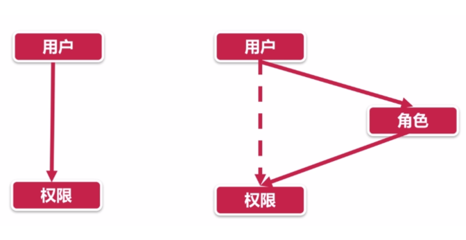

## DataV 的实现 <Badge>待实践</Badge>

> 可以参考[文章](https://juejin.cn/post/6915297687873159176)。

1. 网格式编辑区
2. 可视化组件可自由拖拽组合
3. 支持配置组件参数
4. 支持全屏预览
5. 一键上传即可在线预览
6. 支持导出为 json 文件
7. 支持导入 json 文件
8. 支持一键生成 screenshot

想要实现上传导入导出功能，就需要制定一套 json 与视图转换的方案。

```json
{
  "formControls":[{"id":"1","type":"Text","label":"姓名","placeholder":"请输入姓名"},{"id":"2","type":"Number","label":"年龄","placeholder":" 请输入年龄"},{"id":"4","type":"MySelect","label":"爱好","options":[{"label":"选项一","value":"1"},{"label":"选项二","value":"2"},{"label":"选项三","value":"3"}]}]},"h":172,"type":"Form","category":"base"},"point":{"i":"x-21","x":0,"y":66,"w":24,"h":172,"isBounded":true},"status":"inToCanvas"}],"pageConfig":{"bgColor":"rgba(250,250,250,1)","title":"测试","desc":"测试"}
}
```

## 网页 Dark 模式

- 方案一：通过 JS 探测，在根节点增加 dark 样式。

```js
() => {
  if (
    localStorage.theme === 'dark' ||
    (!('theme' in localStorage) &&
      window.matchMedia('(prefers-color-scheme: dark)').matches)
  ) {
    document.querySelector('html').classList.add('dark');
  } else {
    document.querySelector('html').classList.remove('dark');
  }
};
```

- 方案二：准备两套 css，动态切换 link 标签的 url。
- 方案三：使用 css media 和 css variable。

```css
:root {
  --color: black;
}
p {
  color: var(--color);
}
@media (prefers-color-scheme: dark) {
  :root {
    --color: white;
  }
}
```

## 权限设计

> 详见[文章](https://shuwoom.com/?p=3041)。

四种模型：

- ACL：基于用户的直接权限控制
- RBAC：基于角色的权限控制
- ABAC：基于属性的权限控制
- PBAC：基于策略的权限控制



ABAC 和 PBAC 在互联网场景很少使用。通常使用 RBAC。

## 怎么做性能分析？ <Badge>待补充</Badge>

> 使用 performance API。

## 图片防盗链 <Badge>待补充</Badge>
