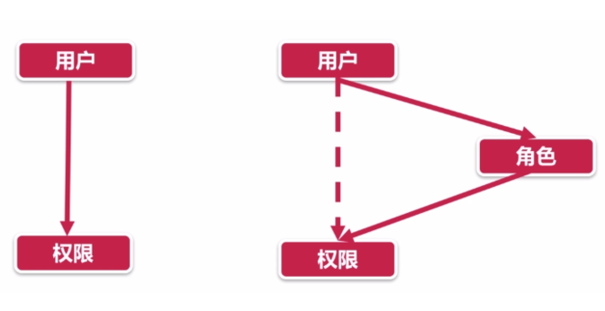

## 如何进行代码质量检测

圈复杂度(Cyclomatic complexity)描写了代码的复杂度，可以理解为覆盖代码所有场景所需要的最少测试用例数量。CC 越高代码越不好维护。

## peerDependency 是为了解决什么问题

## optionalDependencies 的使用场景是什么

当一个包是可依赖可不依赖时，可采用 optionalDependencies，但需要在代码中做好异常处理。

```json
{
  "optionalDependencies": {
    "fsevents": "~2.1.2"
  }
}
```

```js
let fsevents;
try {
  fsevents = require('fsevents');
} catch (error) {
  if (process.env.CHOKIDAR_PRINT_FSEVENTS_REQUIRE_ERROR) console.error(error);
}
```

## 谈谈 semver（语义化版本号）

## 图片防盗链 <Badge>待补充</Badge>

## 网页 Dark 模式

- 方案一：通过 JS 探测，在根节点增加 dark 样式。

```js
() => {
  if (
    localStorage.theme === 'dark' ||
    (!('theme' in localStorage) &&
      window.matchMedia('(prefers-color-scheme: dark)').matches)
  ) {
    document.querySelector('html').classList.add('dark');
  } else {
    document.querySelector('html').classList.remove('dark');
  }
};
```

- 方案二：准备两套 css，动态切换 link 标签的 url。
- 方案三：使用 css media 和 css variable。

```css
:root {
  --color: black;
}
p {
  color: var(--color);
}
@media (prefers-color-scheme: dark) {
  :root {
    --color: white;
  }
}
```

## 权限设计

> 详见[文章](https://shuwoom.com/?p=3041)。

四种模型：

- ACL：基于用户的直接权限控制
- RBAC：基于角色的权限控制
- ABAC：基于属性的权限控制
- PBAC：基于策略的权限控制



ABAC 和 PBAC 在互联网场景很少使用。通常使用 RBAC。

## 前端异常处理如何捕捉及上报

<!-- 　　我做了 XX 项目重构，用了 XX 技术方案，克服了 XX 的困难，最终让 XX 这类需求变更可以短平快的被消化，极速研发、快速上线、且数据采集也做到了标准化，研发成本大大降低，数据积累增长迅速，比如 XX ，最后在 XX 产品线中开始推广。 -->
<!--     1. 哪个项目让你最满意、代表你的最高水平？如何做的？ -->
<!-- 　　2. 让你印象最深刻的一个（技术）难点，害的你搞了很久，最后怎么解的，有什么心得？ -->
<!-- 　　3. 你做的时间最久的一个项目（或产品），你看到这个项目有哪些问题，你能做什么？ -->
<!-- 　　4. 你能给我们团队或者产品带来什么？ -->
