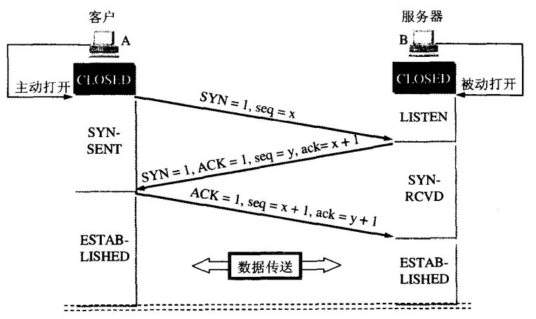
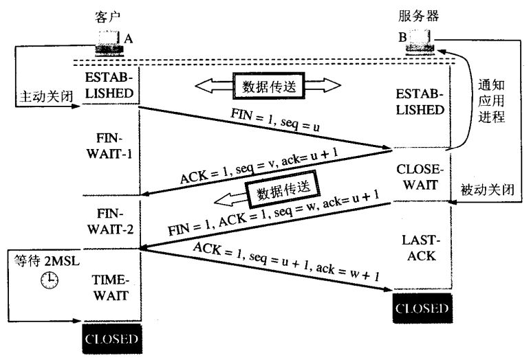
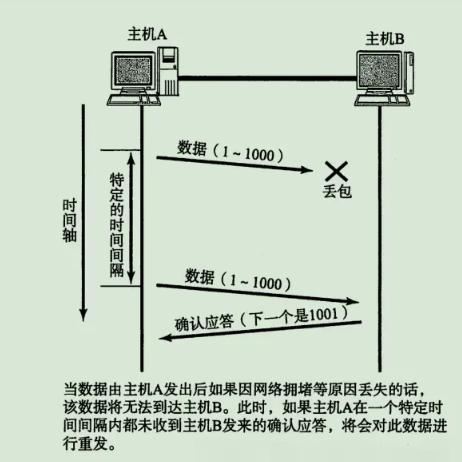
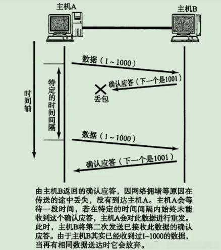
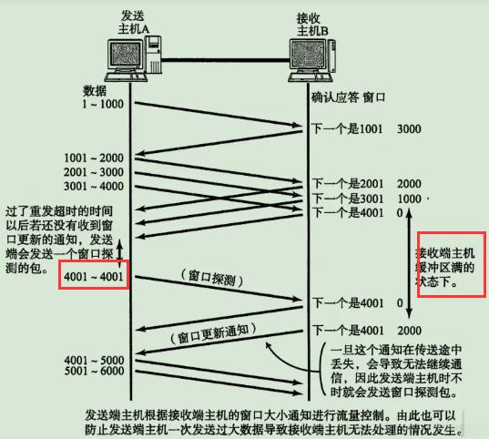
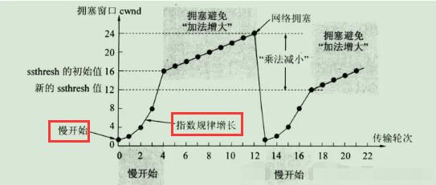

## 网络安全威胁及防范

> 详见[https://eggjs.org/zh-cn/core/security.html](https://eggjs.org/zh-cn/core/security.html)

- XSS 攻击：对 Web 页面注入脚本，使用 JavaScript 窃取用户信息，诱导用户操作。
- CSRF 攻击：伪造用户请求向网站发起恶意请求。
- 钓鱼攻击：利用网站的跳转链接或者图片制造钓鱼陷阱。
- HTTP 参数污染：利用对参数格式验证的不完善，对服务器进行参数注入攻击。
- 远程代码执行：用户通过浏览器提交执行命令，由于服务器端没有针对执行函数做过滤，导致在没有指定绝对路径的情况下就执行命令。

## 跨域及解决

协议，域名，端口，三者有一不一样，就是跨域。

1. CORS，在服务器端设置几个响应头
2. 在 nginx 等反向代理服务器中设置为同一域名

## Cookies 有哪些字段

> 详见[https://zhuanlan.zhihu.com/p/172533051](https://zhuanlan.zhihu.com/p/172533051)

- name
- value
- domain
- path
- expires/max-age
- size
- httpOnly
- secure
- sameSite
- priority

## 简述建立 TCP 连接的三次握手

为什么是三次握手？其实是为了验证客户端和服务器是否具备发送、接收、响应能力。

- 第一次握手可以验证 A 的发送能力和 B 的接收能力；
- 第二次握手可以验证 B 的响应、发送能力和 A 的接收能力；
- 第三次握手可以验证 A 的响应能力。

## 简述建立 TCP 连接的四次挥手

为什么是四次挥手？

- 第一次挥手表达：A 想要断连的意愿，如果 B 数据传完了就通知 A；
- 第二次挥手表达：可能 B 有正在传送的数据，待传送完毕就通知 A；
- 第三次挥手表达：B 数据传送完了，通知 A 可以关闭连接了；
- 第四次挥手表达：告知 B 可以关闭连接了，不用再通知 A 了，A 之后会自行关闭。

## A 记录和 CNAME 记录

> 详见[问答](https://www.zhihu.com/question/22916306)。

A 记录就是把一个域名解析到一个 IP 地址，而 CNAME 记录就是把域名解析到另外一个域名。

为什么有域名？域名的出现是因为比 IP 地址更容易记住。

为什么有 A 记录？因此需要 A 记录保存域名和 IP 地址的映射关系，如果服务器的 IP 地址发生变化就需要修改 A 记录。

为什么有 CNAME 记录？

场景一：

一台服务器 A1 部署了 100 个网站（100 个域名），域名服务器 B 则需要记录 100 个 A 记录，当服务器 A1 迁移到 A2 去了（IP 变了），就需要修改 100 个 A 记录。如果把 100 个域名通过 CNAME 记录指向另一个域名 C，那么域名服务器 B 只需要记录并修改 C 的 A 记录。

那么如果域名 C 变了那不一样要改 100 个 CNAME 记录？IP 变更是常见的情况，而域名 C 是不大会变的。

场景二：

有两个域名 a.me 和 b.me，b.me 指向 145.22.3.116，a.me 指向 b.me，这样看来 a.me 的配置多此一举，直接指向真实的 IP 地址就好了。但是要考虑一个问题，这个 b.me 域名可能不是自己的，那么 b.me 的 IP 地址发生变更时我们无法知情，但是 b.me 这个域名通常是不会改变的。

## TCP 是如何保证可靠性的

> 详见[文章](https://www.pianshen.com/article/57681054083/)。

- 校验和：TCP 检验和的计算与 UDP 一样，检验范围包括 TCP 首部及数据部分,但是 UDP 的检验和字段为可选的，而 TCP 中是必须有的。
- 数据的序列号：TCP 将每个字节的数据都进行了编号，这就是序列号。
  - 可以判断数据的完整性
  - 标识数据的顺序，按序解析
  - 有了序列号，就可以批量发送，一次接受确认，提升效率
  - 去除重复数据
- 确认标识 ACK：接受方确认数据完整后会向发送方发送确认信号，发送方收到该信号后就会继续传送数据。当发送发在一定时间内没有收到接收方的确认信号，就会重传。

  
  

- 三次握手和四次挥手
- 流量控制：接收端处理数据的速度是有限的，如果发送方发送数据的速度过快或发送量过大，导致接收端的缓冲区已经满，这时发送方继续发送报文，就会造成丢包，继而引起丢包重传等一系列连锁反应。因此 TCP 支持根据接收端的处理能力，来决定发送端的发送速度和发送量，这个机制叫做流量控制。

  

- 拥塞控制：如果网络非常拥堵，此时再发送数据就会加重网络负担，那么发送的数据段很可能超过了最大生存时间也没有到达接收方，就会产生丢包问题。为此 TCP 引入了慢启动机制，先发出少量数据，就像探路一样，先摸清当前的网络拥堵状态后，再决定按照多大的速度和发送量来传送数据。

  

## SSH 的原理

> 详见[文章](https://www.jianshu.com/p/33461b619d53)。
