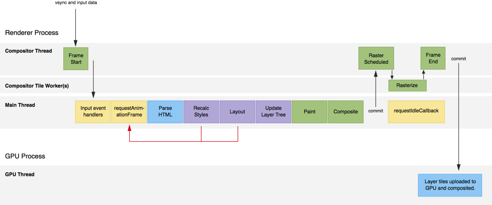

## 图片优化

- 延迟加载

```html

```

```js
document.addEventListener('DOMContentLoaded', () => {
  const imgs = document.querySelectorAll('img');
  imgs.forEach(img => {
    img.src = img.dataset.src;
  });
});
```

- 使用 webp 格式
- 尽可能使用 CSS3 效果代替图片
- 降低图片质量

## webpack 性能优化

可以从几个方面思考：缩减代码体积，网络优化，本地服务器加速。

### 缩减代码体积

- tree shaking
- 将大的外部库指定为 externals，通过 cdn 加载
- 资源压缩：包括 JS 文件，图片等

### 网络优化

- code spliting：拆分资源大小，充分利用 HTTP/2 的多路复用。
- 动态加载：使用 import()，webpack 会按需加载该 chunk。
- 设置 contentHash：contentHash 只会在资源变化时发生改变，这样可以最大限度的利用缓存又不会妨碍资源刷新。

### 本地服务器加速

- dll

## 针对浏览器特性的优化



- 减少重排和重绘
  - 避免频繁修改 dom（如今大多使用虚拟 DOM 框架，不必考虑这问题）
  - 使用 transform 和 opacity 属性来实现动画，这两个属性不会触发重排和重绘
- 使用事件委托可以节省内存
- 时间分片，把耗时的大任务分解成小任务均匀到不同渲染帧中
- 使用 Web Workers，可以独立于主线程之外运行
- 使用 requestAnimationFrame 来实现动画的帧动作，因为动画通常比执行代码耗时，requestAnimationFrame 可以保证在每一帧的开始运行，setInterval 函数无法控制执行点，可能在一帧的末尾，导致丢帧

## 怎么做性能分析？ <Badge>待补充</Badge>

> 使用 performance API。
